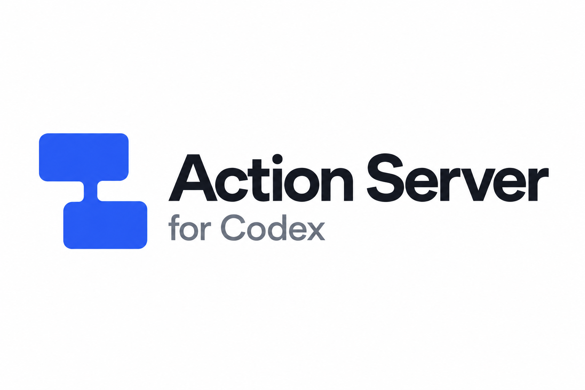
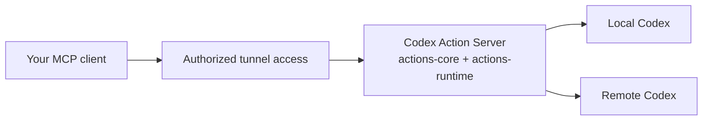

<p align="center">
  
</p>

<h1 align="center">Codex Action Server</h1>

<p align="center">
  Give your MCP client the tools to work with Codex.
</p>

<p align="center">
  Built with <a href="https://github.com/joshyorko/actions">joshyorko/actions</a>
  · <a href="docs/USAGE.md">Get started</a>
  · <a href="docs/CONTAINERS.md">Deploy</a>
  · <a href="docs/NATIVE_CAPABILITIES.md">Explore the tools</a>
</p>

Ask your assistant to find a coding session, check its progress, or start work in
one of your projects. Codex Action Server gives it the MCP tools to do that,
using Codex already running on your workstation or a remote worker.

You choose the machines it can reach and whether it can only read or also take
action. Your client gets a consistent API. Codex keeps doing the coding.

## Built with Actions

This project uses the **actions-core framework from
[joshyorko/actions](https://github.com/joshyorko/actions)** to define typed Python
actions. **actions-runtime** turns those actions into MCP tools and an HTTP API,
with schemas clients can discover. RCC manages the package's pinned Python
environment.

Codex Action Server adds the Codex-specific pieces: connecting to the right
worker, checking requests, and keeping receipts so a lost response does not have
to mean starting the same job twice.



ChatGPT and Friday are clients of this API. The companion
[mcp-tunnel-kit](https://github.com/joshyorko/mcp-tunnel-kit) handles the tunnel
and Executor deployment. Workers run native Codex; they do not need their own
Action Server.

## What can I do with it?

| You want to… | The tools let you… |
| --- | --- |
| Pick up where you left off | Find saved threads in a project and read the conversation. |
| Hand off coding work | Create a thread, start a turn, and choose a supported model and reasoning effort. |
| Check or change direction | Read progress, steer a running turn, or interrupt it. |
| Keep sessions organized | Name, archive, fork, and organize threads into sections. |
| See what a worker can use | Inspect its models, skills, plugins, apps, and MCP servers. |
| Recover after a lost response | Look up a dispatch receipt before deciding what to do next. |

The default package includes 64 actions. For a read-only connection, select the
`observe` profile. You can also deploy the `codex-observe` and `codex-control`
packages separately or together. See [package selection](docs/PACKAGE_COMPOSITION.md)
and the [full tool reference](docs/NATIVE_CAPABILITIES.md).

## Run independently

On Linux, you need Python 3.12 or newer, Actions Runtime 1.0.1 on your `PATH`,
and an existing authenticated native Codex daemon.

Create `config/targets.local.json` from the
[example configuration](config/targets.example.json), keeping only the workers
you want to expose and replacing the example paths with your own. Preserve any
existing configuration. Then run from the repository root:

```sh
export CODEX_ACTION_TARGETS="$PWD/config/targets.local.json"
export CODEX_ACTION_RECEIPTS="$HOME/.local/state/codex-action-server/receipts"
export CODEX_ACTION_DATA="$HOME/.local/state/codex-action-server/runtime"
bash scripts/run.sh
```

Your local MCP endpoint is **`http://127.0.0.1:8088/mcp`**. The HTTP schema is at
`http://127.0.0.1:8088/openapi.json`. Start with `list_targets`, then
`read_server_diagnostics` for your selected target.

The launcher starts the API, not Codex. Keep the private state directories across
restarts. Follow the [setup and first-call guide](docs/USAGE.md) for target
configuration, read-only mode, and dispatch receipts. For containers, use the
[container deployment guide](docs/CONTAINERS.md), which pins Runtime 1.0.2.

## Access stays under your control

Clients select worker names you configured, not arbitrary hosts or sockets.
Thread requests are checked against the requested project and thread. Codex's
own sandbox and approval policy still apply.

The supplied launchers do not enable API-key authentication. Keep the backend
private: loopback on the host, or the prescribed private gateway in containers.
Use Secure MCP Tunnel's authorized access for remote clients. Do not expose the
backend directly to the internet.

Authorized clients share the API's authority. This is not tenant isolation, and
read-only mode is a deployment setting, not a separate permission for each user.
See [deployment boundaries](docs/CONTAINERS.md) before connecting remote clients.

## Dig deeper

| Guide | What's in it |
| --- | --- |
| [Setup and usage](docs/USAGE.md) | Connect a worker, read a thread, and handle retries. |
| [Remote workers](docs/REMOTE_WORKERS.md) | Set up Devsy and Kubernetes workers. |
| [Local container workers](docs/LOCAL_WORKER_PROVIDER.md) | Use Docker or Podman workers. |
| [Package selection](docs/PACKAGE_COMPOSITION.md) | Choose read and control tools. |
| [Native capabilities](docs/NATIVE_CAPABILITIES.md) | Supported methods and Codex version requirements. |
| [Supervision](docs/SUPERVISION.md) | Run as a service and plan rollback. |

<details>
<summary>Development and testing</summary>

The [package manifest](package.yaml) pins the action environment and defines test
and lint tasks. For a project virtual environment:

```sh
uv venv --python 3.12 .venv
uv pip install --python .venv/bin/python --editable '.[test]'
.venv/bin/pytest -q -rs
.venv/bin/ruff check src tests scripts/preflight.py
.venv/bin/ruff format --check src tests scripts/preflight.py
```

HTTP and MCP tests need `action-server` on `PATH` and use disposable native
fixtures. Passing fixtures does not prove a live worker or client connection.
See [provider acceptance](docs/PROVIDER_ACCEPTANCE.md) for that verification and
[design notes](docs/DESIGN.md) for implementation details.

</details>
